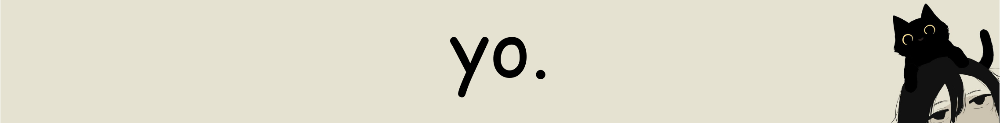

<!-- Banner -->

  

<!-- About Me -->
# Hello there, I'm MrMafu :coffee:

You can just call me mafu. 
I love cats, and programming too I guess... 

You can see more of my work on my profile and [personal portfolio](https://mrmafu-portfolio.vercel.app)!

